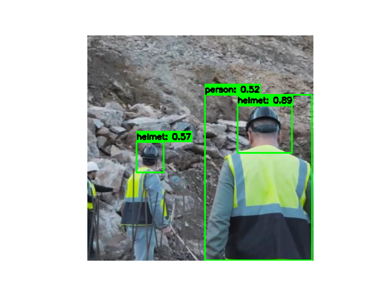

# Helmet Safety Detection using YOLOv10

This project focuses on detecting the use of safety helmets in images using a fine-tuned YOLOv10 model. The model has been trained on a dataset specifically curated for helmet safety detection, and this repository includes code for visualizing training images, making predictions on test images, and displaying the results.

## Table of Contents

- [Installation](#installation)
- [Usage](#usage)
  - [Visualizing Training Images](#visualizing-training-images)
  - [Predicting Test Images](#predicting-test-images)

## Installation

1. **Follow README.md to setup enviroment:**

2. **Running fine-tuning notebook to finetune on safety_helmet_dataset:**

   ```sh
   RUN nootebooks/YOLOv10_Finetunning_NB.ipynb on Google Colab
   ```

3. **Download the fine-tuned model weights and place them in the `model/` directory:**

   Ensure you have the fine-tuned YOLOv10 model named `helmet_check_50epochs.pt` in the `model/` directory.

## Usage

### Visualizing Training Images

To visualize the training images with bounding boxes, modify the `to_visualize_train_images` variable in the `main` function to `True`. This will display the specified number of training images with their respective bounding boxes.

### Predicting Test Images

To predict and visualize the bounding boxes on test images, run the script with the desired index of the test image:

```sh
python script_name.py --index 2
```

This will display the third image from the test dataset with predicted bounding boxes.

## Demo


