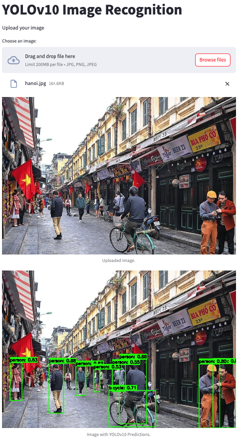

# Streamlit YOLO v10 Image Recognition

## Overview

This project is a Streamlit application that uses YOLO v10 for image recognition. The application allows users to upload images and receive predictions with bounding boxes around detected objects.

## Features

- Upload images for object detection
- Display detected objects with bounding boxes
- User-friendly interface with Streamlit
- Supports multiple image formats

## Demo



## Installation

1. Clone the repository:

   ```sh
   git clone https://github.com/yourusername/streamlit-yolo-v10.git
   cd streamlit-yolo-v10
   ```

2. Create a virtual environment and Install the required packages:

   ```sh
   conda create -n yolov10 python=3.9
   conda activate yolov10
   pip install -r requirements.txt
   cd yolov10
   pip install -e .
   cd ..
   ```

3. Download the YOLO v10 weights and configuration files:
   - [yolov10n.pt](https://github.com/THU-MIG/yolov10/releases/download/v1.1/yolov10n.pt)
   - Place them in the `model` directory.

## Usage

Run the Streamlit application:

```sh
streamlit run app.py
# Local URL: http://localhost:8501
```

Upload an image and see the YOLO v10 detection results.

## Project Structure

```
streamlit-yolo-v10/
│
├── images
├── model
│   └── yolov10n.pt
├── yolov10
├── app.py
├── requirements.txt
├── README.md
└── utils.py
```

- `images/`: Directory to store test and demo images.
- `model/`: Directory to store YOLO v10 weights.
- `yolov10`: Yolov10 original resporitory
- `app.py`: Main Streamlit application file.
- `utils.py`: Utility functions for image processing and YOLO v10 integration.
- `requirements.txt`: Python dependencies.
- `README.md`: Project documentation.
- `utils.py`: Utils file to store the classes of Yolo.

## License

This project is licensed under the MIT License.

## Acknowledgements

- [YOLO v10](https://github.com/THU-MIG/yolov10)
- [Streamlit](https://streamlit.io)
